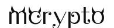

<p align="center">
	<a href=""></a>
</p>
<p align="center">
	<strong>对GO语言标准库crypto的扩展,支持国产SM系列算法</strong>
</p>

<p align="center">
  <a target="_blank" href="">
		
	</a>
	<a target="_blank" href="https://www.oracle.com/java/technologies/javase/javase-jdk8-downloads.html">
		
	</a>
	<a target="_blank" href="">
		
	</a>
	<a href="https://www.apache.org/licenses/LICENSE-2.0">
		
	</a>
</p>


-------------------------------------------------------------------------------
## 使用
```go
go get github.com/mmdet/mcrypto@latest
```

## SM3杂凑算法
实现了标准库的`hash.Hash`接口，同标准库的Hash算法使用保持了一致。
```go
h := sm3.New()
h.Write([]byte("123"))
fmt.Printf("%x \n", h.Sum(nil))
```
## SM2非对称加密算法
### 1.创建密钥对
```go
priv, err := sm2.GenerateKey(rand.Reader)
if err != nil {
	t.Error(err.Error())
	return
}
fmt.Printf("privatekey:%s\n", priv.D.Text(16))
fmt.Printf("publickey x:%s\n", priv.PublicKey.X.Text(16))
fmt.Printf("publickey y:%s\n", priv.PublicKey.Y.Text(16))
```
### 2.加解密
#### 2.1 公钥加密
#### 2.2 私钥解密

### 3.数字签名
mcrypto提供了对原文签名和对摘要签名这两种待签名数据输入形式的签名。
#### 3.1 私钥签名
```go
priv, err := GenerateKey(rand.Reader)
if err != nil {
    t.Error(err.Error())
    return
}
inBytes := []byte("123")
userId  := []byte("1234567812345678")
//第一种签名方式
sign, err := priv.Sign(rand.Reader, inBytes, userId)
//第二种签名方式
sign, err := sm2.Sign(rand.Reader, priv, inBytes, userId)
```
上面是对原文签名，也支持对摘要签名，需要调用者做预处理先生成摘要。

```go
priv, _ := GenerateKey(rand.Reader)
//预处理，生成摘要
inBytes := []byte("123")
userId  := []byte("1234567812345678")
digest, _ := priv.PublicKey.SM3Digest(inBytes, userId)
//第一种签名方式
sign, err := priv.SignDigest(rand.Reader, digest)
//第二种签名方式
sign, err = sm2.SignDigest(rand.Reader, priv, digest)
```
**原文数据一般默认是安全敏感数据，如果签名过程涉及到原文数据的网络传输，通常都是对原文做预处理，生成摘要数据，然后传输至签名服务器，对摘要数据签名。**
#### 3.2 公钥验签：
```go
priv, _ := GenerateKey(rand.Reader)
inBytes := []byte("123")
userId  := []byte("1234567812345678")
sign := []byte("sign")
//第一种方式
result :=priv.PublicKey.Verify(inBytes,userId,sign)
//第二种方式
result := sm2.Verify(&priv.PublicKey, inBytes, userId, sign)
```
上面是使用原文验证签名，也支持使用摘要验证签名
```go
//第一种方式
result := priv.PublicKey.VerifyDigest(inBytes, sign)
//第二种方式
result = sm2.VerifyDigest(&priv.PublicKey, digest, sign)
```